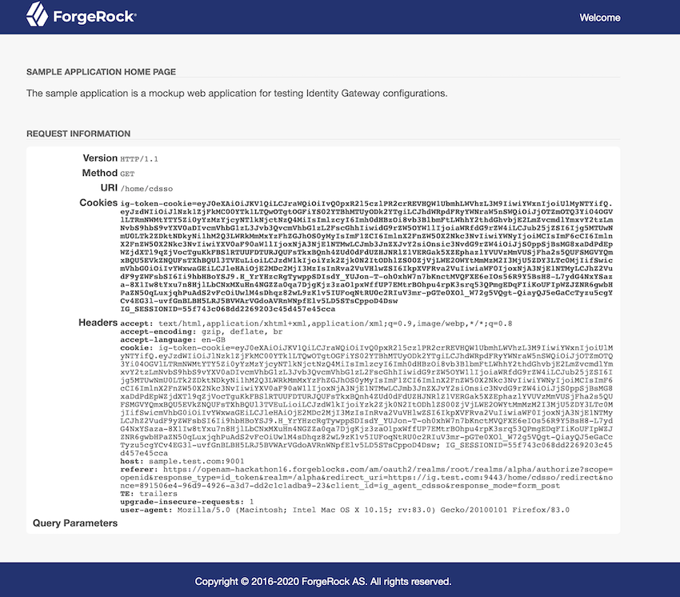

# Deploying PingGateway (Standalone) with CDSSO and PingOne Advanced Identity Cloud (P1AIC)

**Author:** Darinder S. Shokar -- Ping Identity\
**Blog Post:** Coming Soon

------------------------------------------------------------------------

## Overview

This repository provides a simple automation script to:

-   Deploy **PingGateway (Standalone Mode)**
-   Deploy the **PingGateway Sample Application**
-   Protect the sample application using **Cross-Domain Single Sign-On
    (CDSSO)**
-   Integrate with **PingOne Advanced Identity Cloud (P1AIC)**

The script is intended for learning, proof-of-concept environments,
developer enablement, and demonstrations.

------------------------------------------------------------------------

## Repository Contents

When you download this repository, the following files are already
included:

-   `install_ping_gateway_P1AIC.sh`
-   `admin.json.HTTP_ONLY`
-   `admin.json.HTTPS`
-   `static-resources.json`
-   `cdsso-idc.json`

You must download separately:

-   **PingGateway Standalone ZIP**
-   **PingGateway Sample Application JAR**

Download from:\
https://backstage.forgerock.com/downloads/browse/ig/featured

Place both files in the same directory as the script.

------------------------------------------------------------------------

## Prerequisites

-   Linux or macOS
-   Java 17 or later
-   Access to a PingOne Advanced Identity Cloud (P1AIC) tenant

------------------------------------------------------------------------

## Host Configuration

If DNS is not used, update the `/etc/hosts` file on:

-   The PingGateway host
-   The client machine running the browser

Example:

172.168.1.10 pinggateway.test.com sample.test.com

The Sample Application runs on the same host as PingGateway using a
different hostname alias.

------------------------------------------------------------------------

## P1AIC Configuration

### Create a Test User

1.  Log in to ForgeRock Identity Cloud
2.  Select the appropriate realm
3.  Navigate to **Identities → Manage**
4.  Create a new user
5.  Save

### Create a Gateway Agent

1.  Navigate to **Gateways and Agents**
2.  Click **New Gateway/Agent**
3.  Select **Identity Gateway**
4.  Enter:
    -   Agent ID (e.g. `pinggateway_agent_cdsso`)
    -   Password
5.  Save

Ensure these values match the script configuration:

-   `AGENT_ID`
-   `AGENT_SECRET`

### Configure Redirect URIs

HTTPS:

https://pinggateway.test.com:9443/home/cdsso/redirect

HTTP:

http://pinggateway.test.com:9000/home/cdsso/redirect

------------------------------------------------------------------------

## Script Configuration

Open:

`install_ping_gateway_P1AIC.sh`

Modify the configuration section lines 11-30 to reflect your environment
(installation path, hostnames, ports, realm, agent credentials, etc).

------------------------------------------------------------------------

## Execution

For P1AIC deployments, use HTTPS mode due to SameSite cookie
requirements.

Run:

`./install_ping_gateway_P1AIC.sh https`

or

`./install_ping_gateway_P1AIC.sh http`

------------------------------------------------------------------------

## Accessing the Application

HTTPS mode:

`https://pinggateway.test.com:9443/home/cdsso`

HTTP mode:

`http://pinggateway.test.com:9000/home/cdsso`

If you modified ports, the script output will display the correct URL.

On success the sample application will display:



------------------------------------------------------------------------

# Script Output
```sh
=== Environment check ===
Script bundle: /<PATH>/PingGatewayIntegrationwithP1AIC-2025/PingGatewayIntegrationwithP1AIC-main
Install dir:   /<PATH>/PingGatewayIntegrationwithP1AIC-2025/pingGatewayDeployment

This will:
 - Install PingGateway (https)
 - Deploy the sample app
 - Configure CDSSO route for P1AIC
 - Install into: /<PATH>/PingGatewayIntegrationwithP1AIC-2025/pingGatewayDeployment

Proceed?
Enter Y to continue: Y
Removing existing install: /<PATH>/PingGatewayIntegrationwithP1AIC-2025/pingGatewayDeployment
=== Deploying PingGateway ===
Bootstrap start/stop to initialise directories
Stopping processes by pattern: openig
=== Configuring PingGateway (https) ===
Generating 2,048 bit RSA key pair and self-signed certificate (SHA256withRSA) with a validity of 90 days
	for: CN=pinggateway.test.com, O=Example Corp, C=Ping
Configured HTTPS on port 9443
=== Deploying Sample App ===
=== Configuring routes ===
=== Starting Sample App ===
=== Stopping Sample App ===
Stopping processes by pattern: PingGateway-sample-application-2025.11.1.jar
Sample: http://sample.test.com:9001/home
Log:    /<PATH>/PingGatewayIntegrationwithP1AIC-2025/pingGatewayDeployment/sample_app/console.log
=== Starting PingGateway ===
=== Stopping PingGateway ===
Log: /<PATH>/PingGatewayIntegrationwithP1AIC-2025/pingGatewayDeployment/identity-gateway-2025.11.1/ping_gateway_config/logs/console.out
Access: https://pinggateway.test.com:9443/home/cdsso
Done.
```

------------------------------------------------------------------------

## Important Login Note

If you were already logged into P1AIC during setup, close the browser or
log out first.

Otherwise you may receive:

`#error_description=Resource%20Owner%20Session%20not%20valid&error=access_denied`

------------------------------------------------------------------------

## Service Control

Stop the PingGateway and Sample applications:

`./install_ping_gateway_P1AIC.sh stop`

Start the PingGateway and Sample applications:

`./install_ping_gateway_P1AIC.sh start`

------------------------------------------------------------------------

## Operating Modes

The script deploys PingGateway in Production Mode by default.

To enable Development Mode (e.g. for PingGateway Studio), modify
`admin.json`.

Documentation:\
https://docs.pingidentity.com/pinggateway/latest/configure/operating-modes.html

------------------------------------------------------------------------

## Uninstall

Stop services:

./install_ping_gateway_P1AIC.sh stop

Then delete the installation directory defined in the script.

------------------------------------------------------------------------

## Further Reading

CDSSO Documentation:\
https://docs.pingidentity.com/pinggateway/latest/aic/cdsso.html

PingGateway Documentation:\
https://docs.pingidentity.com/pinggateway/latest/

------------------------------------------------------------------------

This repository provides a clean, reproducible way to deploy PingGateway
locally and understand CDSSO integration with P1AIC.

------------------------------------------------------------------------